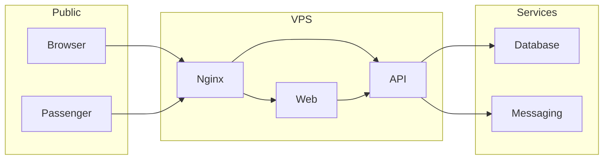

## Executive summary

The highest risks are direct exposure of Supabase tables through existing `anon`/`authenticated` grants without RLS, unencrypted database connections in the sampled live configuration, and tenant or admin mistakes that could disclose passenger and finance data. Code hardening is present in this branch; the database migration and VPS/dashboard controls still need staging and production rollout.

## Scope and assumptions

Scope: `apps/web`, `apps/api`, `prisma`, and `deploy/hostinger`. Runtime is a public Next.js frontend and Express API on one Hostinger HTTPS origin, with Prisma connecting to Supabase PostgreSQL and optional email/SMS/WhatsApp providers. Passengers have no accounts; staff are authenticated. India is the first market. Hostinger and Supabase dashboard settings are outside repository control. Scale, approved legal retention periods, provider locations, and actual upstream DDoS capacity remain open questions.

## System model

### Primary components

- Next.js pages, proxy, and server API helper (`apps/web/proxy.ts`, `apps/web/src/lib/server-api.ts`).
- Express routes, authentication, tenant checks, and services (`apps/api/src/app.ts`, `apps/api/src/middleware`, `apps/api/src/services`).
- Supabase PostgreSQL through Prisma (`apps/api/src/config/prisma.ts`, `prisma/schema.prisma`) and in-process rate-limit state (`apps/api/src/middleware/rate-limit.ts`).
- Nginx and systemd deployment templates (`deploy/hostinger`).

### Data flows and trust boundaries

- Internet → Nginx → Next.js: HTTPS, public pages and staff UI; TLS and edge limits depend on deployment configuration. Form input is then sent to the API.
- Browser → Express `/api`: same origin in production, cookie sessions, CSRF Origin check on writes, JSON size cap, Helmet, request limits; Zod validation in controllers.
- Staff/API → PostgreSQL: Prisma queries use credentials in `DATABASE_URL`. Production now requires `sslmode=verify-full` and a CA path; this has not been configured on the sampled live connection.
- API request → in-process counter: rate limits are local to one API process and reset on restart.
- API → email/SMS/WhatsApp providers: registration/reset tokens and passenger notifications cross provider boundaries; provider credentials are environment secrets.
- Public passenger → privacy request queue → Super Admin: PNR and contact details enter a pending queue; manual identity verification and a recorded review precede export or erasure.

#### Diagram

## Assets and security objectives

| Asset | Why it matters | Objective |
| --- | --- | --- |
| Passenger identity, contact and travel data | Personal data and itinerary exposure | Confidentiality, integrity |
| Bookings, payments, refunds, ledger | Operational and financial decisions | Integrity, availability |
| Staff accounts, roles and sessions | Control over tenant and platform access | Confidentiality, integrity |
| Database, JWT and provider credentials | Can unlock broad access | Confidentiality |
| Privacy requests and audit records | Evidence for rights handling and incident review | Integrity, availability |

## Attacker model

### Capabilities

An unauthenticated internet user can submit public forms and attempt login and reset flows. A compromised staff account can call API endpoints directly and alter client-supplied tenant IDs. An agency admin can manage its own staff and inspect its own data. A network attacker could observe plaintext database traffic if positioned on the path.

### Non-capabilities

No attacker is assumed to hold Supabase dashboard access, a database owner credential, server shell access, or a valid Super Admin session. These become incident scenarios if credentials are stolen.

## Entry points and attack surfaces

| Surface | How reached | Boundary | Notes | Evidence |
| --- | --- | --- | --- | --- |
| Auth and invitations | `/api/auth/*` | Public to API | Password, OTP, token parsers; per-route limits | `apps/api/src/routes/auth.routes.ts` |
| Public privacy form | `/api/privacy/public-requests` | Public to API | PNR and contact data; rate limited | `apps/api/src/routes/privacy.routes.ts` |
| Tenant CRUD and transport | `/api/tenants`, management, transport | Staff to tenant data | Agency/branch checks | `apps/api/src/middleware/tenant-policy.ts` |
| Booking, bulk and exports | `/api` booking and bulk routes | Staff to passenger data | CSV/PDF output and import parsers | `apps/api/src/routes/booking.routes.ts`, `apps/api/src/routes/bulk.routes.ts` |
| Finance and Stage 4 | `/api` finance and stage4 routes | Staff to financial/provider data | Offline payment records, notification calls | `apps/api/src/routes/finance.routes.ts`, `apps/api/src/routes/stage4.routes.ts` |
| Admin roles and privacy queue | `/api` roles and privacy routes | Agency/platform privilege | Role mutation, verified exports | `apps/api/src/routes/roles.routes.ts`, `apps/api/src/routes/privacy.routes.ts` |
| Supabase Data API | Supabase project endpoint | Internet to database | Existing grants and absent RLS found by audit | `scripts/supabase-security-audit.ts`, `prisma/migrations/20261002121000_restrict_supabase_data_api` |

## Top abuse paths

1. Attacker obtains a Supabase anon key, queries a public table with current grants and no RLS, and extracts passenger or staff records.
2. Network observer intercepts a current plaintext database connection and learns or modifies sensitive data.
3. Attacker steals a staff cookie, attempts cross-tenant exports, and gains another agency's data if any route omits its tenant predicate.
4. Agency admin changes a role's permissions; an existing session retains privilege unless role members' sessions are revoked.
5. Bot distributes login or OTP attempts across IPs to guess credentials or exhaust email capacity; process-local account limits reduce this but restart or multiple processes weaken them.
6. Passenger impersonator submits a real PNR and matching contact, then pressures an admin to release an export without independent identity verification.
7. High-volume traffic exhausts VPS or database capacity before application limits can respond; Nginx limits do not stop volumetric DDoS.

## Threat model table

| Threat ID | Threat source | Prerequisites | Threat action | Impact | Impacted assets | Existing controls (evidence) | Gaps | Recommended mitigations | Detection ideas | Likelihood | Impact severity | Priority |
| --- | --- | --- | --- | --- | --- | --- | --- | --- | --- | --- | --- | --- |
| TM-001 | Internet client | Data API reachable with project key | Query public tables | Broad data disclosure | Passenger, staff, finance | Revoke migration prepared in `prisma/migrations` | Live grants remain; Data API status unknown | Apply migration, disable Data API, audit grants | Alert on PostgREST access and audit output | High | High | Critical |
| TM-002 | Network observer | Position on DB path | Read or alter plaintext PostgreSQL traffic | Data and credential exposure | Database and records | Production URL gate in `config/env.ts` | Sampled live connection lacked TLS | Install project CA, verify-full, enforce SSL | Check `pg_stat_ssl` and connection failures | Medium | High | High |
| TM-003 | Compromised staff | Valid staff account | Manipulate tenant IDs or export path | Cross-agency disclosure | Bookings, finance | Tenant policy and service tests | Full two-agency integration matrix pending | Run staging matrix for all read/write/export/bulk routes | Audit cross-tenant 403 and exports | Medium | High | High |
| TM-004 | Stolen session | Cookie disclosure | Reuse privilege after role change or logout | Account takeover | Staff and admin access | Server-side Session revocation, 8h Super Admin TTL in `auth.service.ts` | MFA deferred | Deploy migration, consider MFA later, monitor privileged logins | SecurityEvent and login anomalies | Medium | High | High |
| TM-005 | Bot | Public form or auth access | Credential stuffing or resource exhaustion | Account and availability harm | Accounts, VPS | In-process and Nginx limits | No CDN/WAF; counters reset and are not shared | Use one API process for now; add shared limits and upstream protection before scaling | 429/5xx and CPU alerts | High | Medium | High |
| TM-006 | Impersonator | Knows PNR and contact | Convince reviewer to export/delete | Personal data disclosure or erasure | Passenger data | Pending queue, manual note, matching checks in `privacy.service.ts` | Human verification quality varies | Written verification procedure and two-person review for deletion | Review notes and export events | Medium | High | High |
| TM-007 | Attacker website | Victim has session cookie | Send cross-site write | Unauthorized mutation | Tenant data | Same-origin check, SameSite cookie in `csrf.ts` and `cookies.ts` | Browser origin deployment must match `WEB_URL` | Staging CSRF tests on real origin | Invalid-origin 403 counts | Medium | Medium | Medium |

## Criticality calibration

- Critical: unauthenticated disclosure of all passenger records or database owner compromise.
- High: one agency's booking export to another, Super Admin takeover, or interception of the database connection.
- Medium: targeted request flooding that degrades booking work or a single rejected privacy request mishandled without data release.
- Low: harmless header disclosure or short-lived anonymous form spam contained by limits.

## Focus paths for security review

| Path | Why it matters | Related Threat IDs |
| --- | --- | --- |
| `scripts/supabase-security-audit.ts` | Detect live grants and TLS state | TM-001, TM-002 |
| `prisma/migrations/20261002121000_restrict_supabase_data_api` | Removes public API role privileges | TM-001 |
| `apps/api/src/config/env.ts` | Production TLS and origin gate | TM-002, TM-007 |
| `apps/api/src/services/auth.service.ts` | Session lifecycle and OTP | TM-004, TM-005 |
| `apps/api/src/middleware/tenant-policy.ts` | Shared authorization boundary | TM-003 |
| `apps/api/src/services/booking.service.ts` | Passenger and booking access | TM-003 |
| `apps/api/src/services/bulk-data.service.ts` | Bulk import/export boundary | TM-003 |
| `apps/api/src/services/privacy.service.ts` | Manual verification and erasure | TM-006 |
| `deploy/hostinger/nginx.conf.example` | Public traffic edge | TM-005, TM-007 |

## Notes on use

This model uses the approved deployment assumptions. It distinguishes implemented repository changes from live settings. Review the seven threat paths after staging tests, especially Supabase grants and role-by-role tenant behavior. Runtime services are in scope; build and test tooling is included only where it affects deployment. The actual edge configuration, legal retention schedule, Data API setting, and production scale require operator confirmation.
